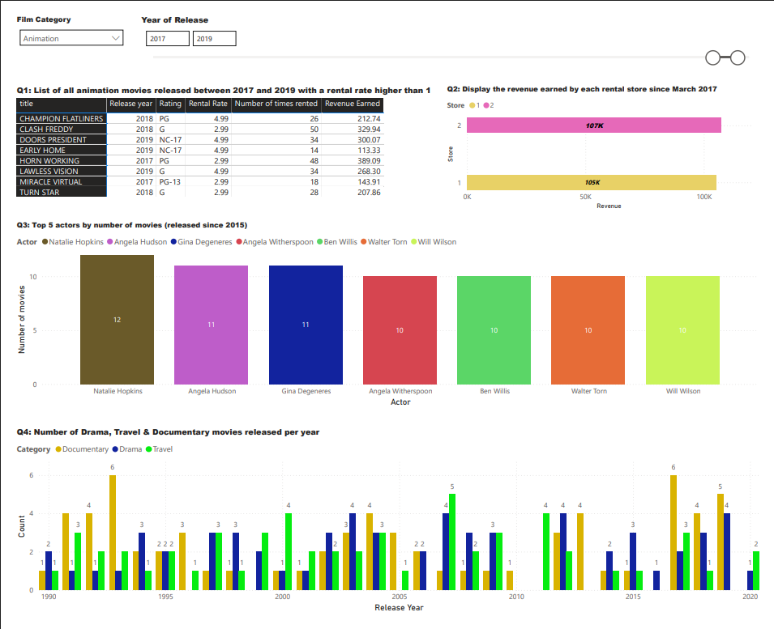

# 📊 DVD Rental Reports (Power BI)

This Power BI project is built using the classic **DVD Rental** PostgreSQL database. It demonstrates data modeling, DAX calculations, and interactive visualizations to answer practical business questions.

---

## 🔧 Tools & Stack

- Power BI Desktop  
- PostgreSQL dvdrental database  
- Power Query (M language)  
- DAX (for measures and logic)

---

## 📊 Key Reports & Visuals

### Q1: List of Animation Movies (2017–2019) with Rental Rate > 1
- **Visual:** Matrix table  
- **Techniques:**  
  - List slicer for `"Animation"` category  
  - Between slicer for release years (2017–2019)  
  - Advanced filter on `rental_rate > 1`

---

### Q2: Store Revenue Since March 2017
- **Visual:** Stacked bar chart  
- **Techniques:**  
  - Joined `payment` and `rental` tables  
  - Filtered `payment_date >= March 1, 2017`  
  - Grouped by `store_id`, summed payment amounts

---

### Q3: Top 5 Actors by Movie Count (Since 2015)
- **Visual:** Stacked column chart  
- **Techniques:**  
  - Filtered `film[release_year] > 2014`  
  - Counted distinct `film_id` per actor  
  - Applied Top N filter — ties resulted in 7 actors shown

---

### Q4: Movie Counts per Year for Drama, Travel, and Documentary
- **Visual:** Clustered column chart  
- **Techniques:**  
  - Used `film_category` and `release_year`  
  - Category used as legend  
  - Filtered to include only Drama, Travel, and Documentary

---

## 📁 Files Included

- `/images/` – Screenshots of key visuals  
- `/exports/dvdrental_report.pdf` – Exported PDF version of the dashboard

---

## 📷 Screenshots

> *(Add screenshots here using Markdown syntax once uploaded)*

```markdown

