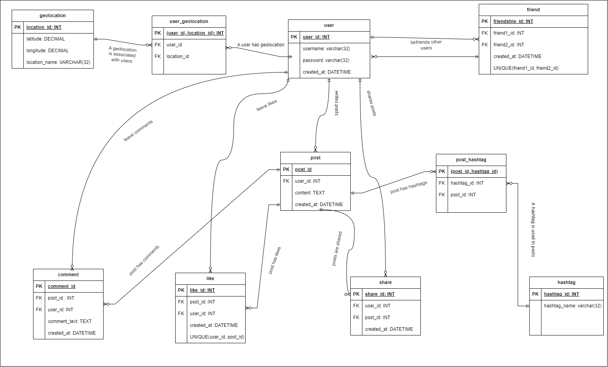

# Schema Design and Structure Using DDL
This section demonstrates the use of Data Definition Language (DDL). It covers schema-related operations such as creating, altering, and dropping tables, defining constraints, and managing indexes to structure and optimize the database.

### Task:
- Create a physical database with a separate database and schema and give it an appropriate domain-related name. 
- The database must be in 3NF
- Use appropriate data types for each column and apply DEFAULT values, and GENERATED ALWAYS AS columns as required.
- Create relationships between tables using primary and foreign keys.
- Apply five check constraints across the tables to restrict certain values, including
  - date to be inserted, which must be greater than January 1, 2000
  - inserted measured value that cannot be negative
  - inserted value that can only be a specific value (as an example of gender)
  - unique
  - not null
- Populate the tables with the sample data generated, ensuring each table has at least two rows (for a total of 20+ rows in all the tables).
- Add a not null 'record_ts' field to each table using ALTER TABLE statements, set the default value to current_date, and check to make sure the value has been set for the existing rows.

### Social Media Database Schema


### SQL Code:
```sql
CREATE DATABASE social_media; 

CREATE SCHEMA IF NOT EXISTS social_network; 

--Table: user
CREATE TABLE IF NOT EXISTS social_network.user (
	user_id SERIAL PRIMARY KEY, -- I used SERIAL here INSTEAD OF INT AS I want the user_id TO be auto generated
	username VARCHAR(32) NOT NULL UNIQUE,
	password VARCHAR(32) NOT NULL,
	created_at TIMESTAMP DEFAULT CURRENT_TIMESTAMP --I used TIMESTAMP IN my queries INSTEAD OF datetime AS indicated IN my diagram, AS I believe timestamp works better WITH Postgres
);

-- Table: geolocation
CREATE TABLE IF NOT EXISTS social_network.geolocation(
	location_id SERIAL PRIMARY KEY, --same AS FOR user_id, I used SERIAL INSTEAD OF INT
	latitude DECIMAL (9, 6) NOT NULL,
	longitude DECIMAL(9, 6) NOT NULL,
    location_name VARCHAR(32)
);


-- Table: user_geolocation (junction table between user and geolocation)
CREATE TABLE IF NOT EXISTS  social_network.user_geolocation 
(
    user_id INT NOT NULL,
    location_id INT NOT NULL,
    PRIMARY KEY (user_id, location_id),
    FOREIGN KEY (user_id) REFERENCES social_network.user(user_id),
    FOREIGN KEY (location_id) REFERENCES social_network.geolocation(location_id)
);

-- Table: post
CREATE TABLE IF NOT EXISTS  social_network.post (
    post_id SERIAL PRIMARY KEY,
    user_id INT NOT NULL,
    content TEXT NOT NULL,
    created_at TIMESTAMP DEFAULT CURRENT_TIMESTAMP,
    FOREIGN KEY (user_id) REFERENCES social_network.user(user_id)
);

-- Table: like
CREATE TABLE IF NOT EXISTS  social_network.like (
    like_id SERIAL PRIMARY KEY,
    user_id INT NOT NULL,
    post_id INT NOT NULL,
    created_at TIMESTAMP DEFAULT CURRENT_TIMESTAMP,
    FOREIGN KEY (user_id) REFERENCES social_network.user(user_id),
    FOREIGN KEY (post_id) REFERENCES social_network.post(post_id),
    UNIQUE (user_id, post_id) -- Ensures a user can like a post only once
);

-- Table: comment
CREATE TABLE IF NOT EXISTS  social_network.comment (
    comment_id SERIAL PRIMARY KEY,
    post_id INT NOT NULL,
    user_id INT NOT NULL,
    comment_text TEXT NOT NULL,
    created_at TIMESTAMP DEFAULT CURRENT_TIMESTAMP,
    FOREIGN KEY (post_id) REFERENCES social_network.post(post_id),
    FOREIGN KEY (user_id) REFERENCES social_network.user(user_id)
);

-- Table: share
CREATE TABLE IF NOT EXISTS  social_network.share (
    share_id SERIAL PRIMARY KEY,
    user_id INT NOT NULL,
    post_id INT NOT NULL,
    created_at TIMESTAMP DEFAULT CURRENT_TIMESTAMP,
    FOREIGN KEY (user_id) REFERENCES social_network.user(user_id),
    FOREIGN KEY (post_id) REFERENCES social_network.post(post_id)
);

-- Table: friend (self-referencing table for user friendships)
CREATE TABLE IF NOT EXISTS  social_network.friend (
    friendship_id SERIAL PRIMARY KEY,
    friend1_id INT NOT NULL,
    friend2_id INT NOT NULL,
    created_at TIMESTAMP DEFAULT CURRENT_TIMESTAMP,
    UNIQUE (friend1_id, friend2_id),
    FOREIGN KEY (friend1_id) REFERENCES social_network.user(user_id),
    FOREIGN KEY (friend2_id) REFERENCES social_network.user(user_id)
);

-- Table: hashtag
CREATE TABLE IF NOT EXISTS  social_network.hashtag (
    hashtag_id SERIAL PRIMARY KEY,
    hashtag_name VARCHAR(32) NOT NULL UNIQUE
);

-- Table: post_hashtag (junction table between post and hashtag)
CREATE TABLE IF NOT EXISTS  social_network.post_hashtag (
    post_id INT NOT NULL,
    hashtag_id INT NOT NULL,
    PRIMARY KEY (post_id, hashtag_id),
    FOREIGN KEY (post_id) REFERENCES social_network.post(post_id),
    FOREIGN KEY (hashtag_id) REFERENCES social_network.hashtag(hashtag_id)
);

--I forgot to add CHECK constraint to "created_at" when creating tables, therefore, I'm altering tables here:

-- Apply date constraint to the user table
ALTER TABLE social_network.user
ADD CONSTRAINT check_user_created_at CHECK (created_at >= '2000-01-01');

-- Apply date constraint to the post table
ALTER TABLE social_network.post
ADD CONSTRAINT check_post_created_at CHECK (created_at >= '2000-01-01');

-- Apply date constraint to the like table
ALTER TABLE social_network.like
ADD CONSTRAINT check_like_created_at CHECK (created_at >= '2000-01-01');

-- Apply date constraint to the comment table
ALTER TABLE social_network.comment
ADD CONSTRAINT check_comment_created_at CHECK (created_at >= '2000-01-01');

-- Apply date constraint to the share table
ALTER TABLE social_network.share
ADD CONSTRAINT check_share_created_at CHECK (created_at >= '2000-01-01');

-- Apply date constraint to the friend table
ALTER TABLE social_network.friend
ADD CONSTRAINT check_friend_created_at CHECK (created_at >= '2000-01-01');


--Inserting data into my social_media DB's tables
-- Insert sample data into the user table
INSERT INTO social_network.user (username, password, created_at)
VALUES 
    ('arsadilkhan', 'mypassword123', '2022-03-15'),
    ('cristiano', 'cristiano777', '2023-05-10')
ON CONFLICT (username) DO NOTHING;

-- Insert data into the geolocation table
INSERT INTO social_network.geolocation (latitude, longitude, location_name)
VALUES 
    (34.052235, -118.243683, 'Almaty'),
    (40.712776, -74.005974, 'Madrid')
ON CONFLICT (location_name) DO NOTHING;

-- Insert sample data into the user_geolocation table
INSERT INTO social_network.user_geolocation (user_id, location_id)
VALUES 
    ((SELECT user_id FROM social_network.user WHERE LOWER(username) = 'arsadilkhan'), 
     (SELECT location_id FROM social_network.geolocation WHERE UPPER(location_name) = 'ALMATY')),

    ((SELECT user_id FROM social_network.user WHERE LOWER(username) = 'cristiano'), 
     (SELECT location_id FROM social_network.geolocation WHERE UPPER(location_name) = 'MADRID'))
ON CONFLICT DO NOTHING;

-- Insert sample data into the post table
INSERT INTO social_network.post (user_id, content)
VALUES 
    ((SELECT user_id FROM social_network.user WHERE LOWER(username) = 'arsadilkhan'), 'Hi, my name is Arslan'),
    ((SELECT user_id FROM social_network.user WHERE LOWER(username) = 'cristiano'), 'Hala Madrid!')
ON CONFLICT DO NOTHING;

-- Insert sample data into the like table
INSERT INTO social_network.like (user_id, post_id)
VALUES 
    ((SELECT user_id FROM social_network.user WHERE LOWER(username) = 'arsadilkhan'),
     (SELECT post_id FROM social_network.post WHERE content = 'Hala Madrid!')),  -- arsadilkhan likes cristiano's post

    ((SELECT user_id FROM social_network.user WHERE LOWER(username) = 'cristiano'),
     (SELECT post_id FROM social_network.post WHERE content = 'Hi, my name is Arslan'))  -- cristiano likes arsadilkhan's post
ON CONFLICT DO NOTHING;

-- Insert sample data into the comment table
INSERT INTO social_network.comment (post_id, user_id, comment_text)
VALUES 
    ((SELECT post_id FROM social_network.post WHERE content = 'Hi, my name is Arslan'),
     (SELECT user_id FROM social_network.user WHERE LOWER(username) = 'cristiano'), 'Welcome to Almaty!'),

    ((SELECT post_id FROM social_network.post WHERE content = 'Hala Madrid!'),
     (SELECT user_id FROM social_network.user WHERE LOWER(username) = 'arsadilkhan'), 'Thanks, great to be here!')
ON CONFLICT DO NOTHING;

-- Insert sample data into the share table
INSERT INTO social_network.share (user_id, post_id)
VALUES 
    ((SELECT user_id FROM social_network.user WHERE LOWER(username) = 'arsadilkhan'),
     (SELECT post_id FROM social_network.post WHERE content = 'Hala Madrid!')),  -- arsadilkhan shares cristiano's post

    ((SELECT user_id FROM social_network.user WHERE LOWER(username) = 'cristiano'),
     (SELECT post_id FROM social_network.post WHERE content = 'Hi, my name is Arslan'))  -- cristiano shares arsadilkhan's post
ON CONFLICT DO NOTHING;

-- Insert sample data into the friend table
INSERT INTO social_network.friend (friend1_id, friend2_id)
VALUES 
    ((SELECT user_id FROM social_network.user WHERE LOWER(username) = 'arsadilkhan'),
     (SELECT user_id FROM social_network.user WHERE LOWER(username) = 'cristiano')),  -- arsadilkhan and cristiano are friends

    ((SELECT user_id FROM social_network.user WHERE LOWER(username) = 'cristiano'),
     (SELECT user_id FROM social_network.user WHERE LOWER(username) = 'arsadilkhan')) -- Reciprocal friendship
ON CONFLICT DO NOTHING;

-- Insert sample data into the hashtag table
INSERT INTO social_network.hashtag (hashtag_name)
VALUES 
    ('football'),
    ('RealMadrid')
ON CONFLICT DO NOTHING;

-- Insert sample data into the post_hashtag table
INSERT INTO social_network.post_hashtag (post_id, hashtag_id)
VALUES 
    ((SELECT post_id FROM social_network.post WHERE content = 'Hi, my name is Arslan'),
     (SELECT hashtag_id FROM social_network.hashtag WHERE hashtag_name = 'football')),

    ((SELECT post_id FROM social_network.post WHERE content = 'Hala Madrid!'),
     (SELECT hashtag_id FROM social_network.hashtag WHERE hashtag_name = 'RealMadrid'))
ON CONFLICT DO NOTHING;

    
 --adding record_ts column to all tables
    
 -- Add record_ts column to the user table
ALTER TABLE social_network.user
ADD COLUMN record_ts DATE NOT NULL DEFAULT current_date;

-- Add record_ts column to the geolocation table
ALTER TABLE social_network.geolocation
ADD COLUMN record_ts DATE NOT NULL DEFAULT current_date;

-- Add record_ts column to the user_geolocation table
ALTER TABLE social_network.user_geolocation
ADD COLUMN record_ts DATE NOT NULL DEFAULT current_date;

-- Add record_ts column to the post table
ALTER TABLE social_network.post
ADD COLUMN record_ts DATE NOT NULL DEFAULT current_date;

-- Add record_ts column to the like table
ALTER TABLE social_network.like
ADD COLUMN record_ts DATE NOT NULL DEFAULT current_date;

-- Add record_ts column to the comment table
ALTER TABLE social_network.comment
ADD COLUMN record_ts DATE NOT NULL DEFAULT current_date;

-- Add record_ts column to the share table
ALTER TABLE social_network.share
ADD COLUMN record_ts DATE NOT NULL DEFAULT current_date;

-- Add record_ts column to the friend table
ALTER TABLE social_network.friend
ADD COLUMN record_ts DATE NOT NULL DEFAULT current_date;

-- Add record_ts column to the hashtag table
ALTER TABLE social_network.hashtag
ADD COLUMN record_ts DATE NOT NULL DEFAULT current_date;

-- Add record_ts column to the post_hashtag table
ALTER TABLE social_network.post_hashtag
ADD COLUMN record_ts DATE NOT NULL DEFAULT current_date;

--to implement ALWAYS GENERATED AS I had to add a new column, as I didn't see where I could add it without changing the structure
ALTER TABLE social_network.geolocation
ADD COLUMN location_description VARCHAR(64) GENERATED ALWAYS AS (
    'Lat: ' || latitude || ', Long: ' || longitude
) STORED;

--Adding new column gender to comply with five constraint requirements
ALTER TABLE social_network.user
ADD COLUMN gender VARCHAR(10),
ADD CONSTRAINT check_gender_values CHECK (gender IN ('Male', 'Female', 'Other'));

COMMIT; 
```


