# SQLBolt Solutions

This section contains solutions to interactive SQL lessons from [SQLBolt](https://sqlbolt.com/). Each query is based on exercises covering filtering, sorting, joins, aggregations, and subqueries.

Solutions are written using clean and readable SQL syntax.

---

## Screenshots of Completed Lessons

### Exercise 1
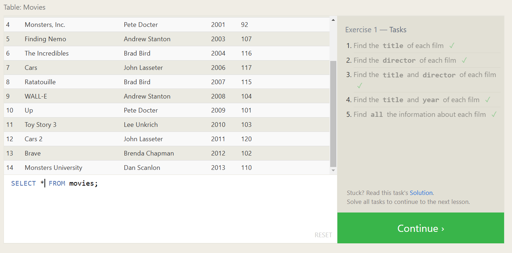

### Exercise 2
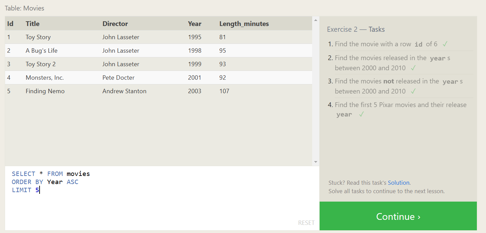

### Exercise 3
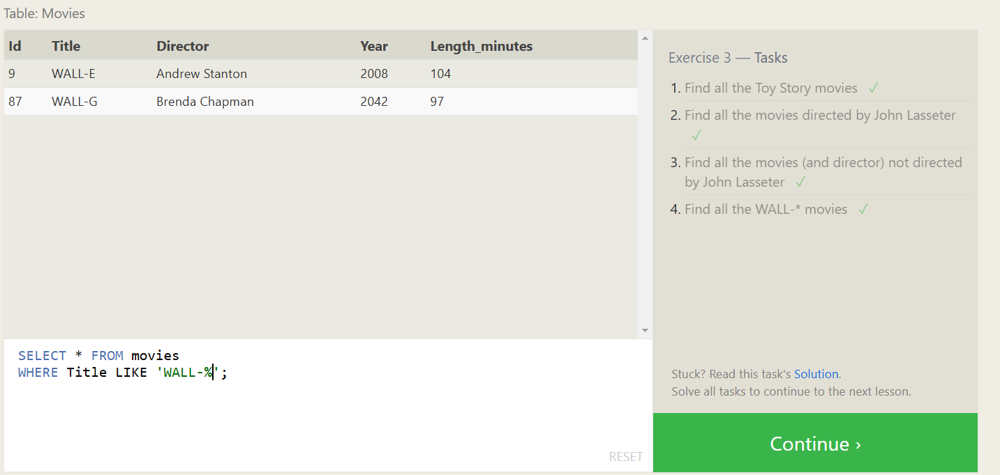

### Exercise 4
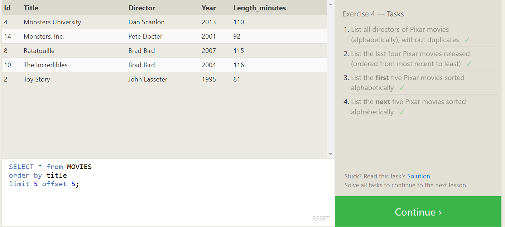

### Exercise 5

### Exercise 6
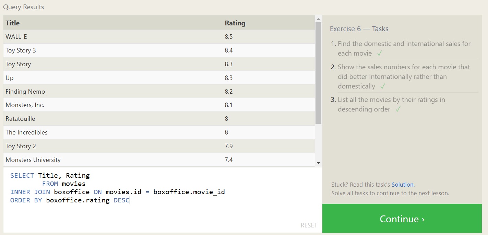

### Exercise 7
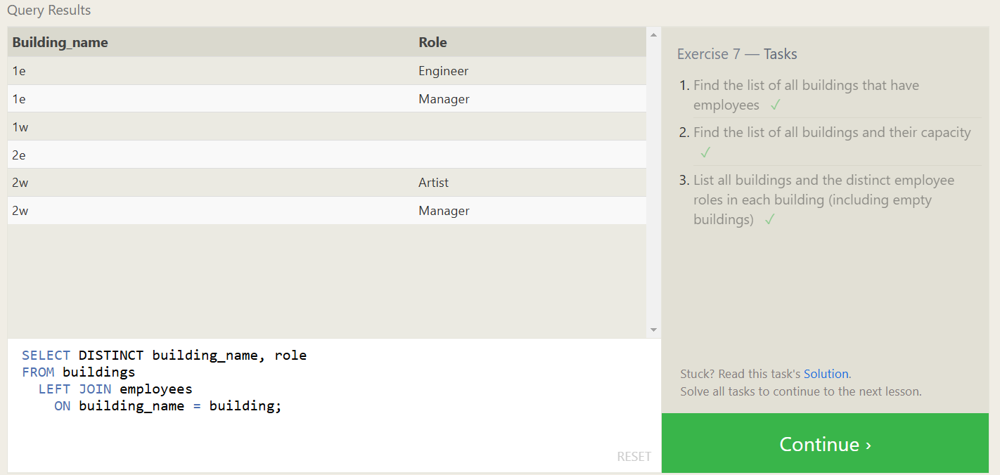

### Exercise 8
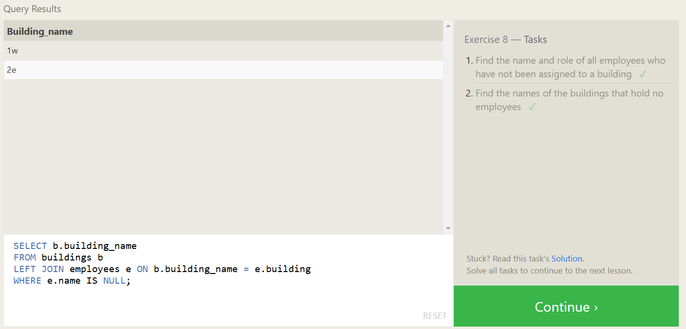

### Exercise 9
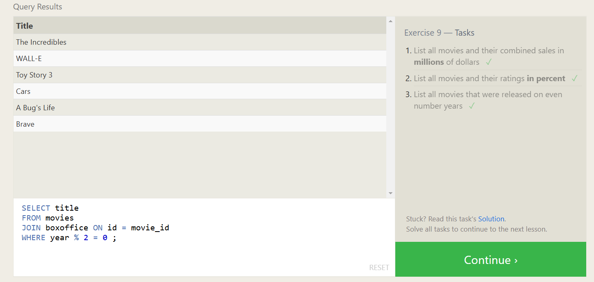

### Exercise 10
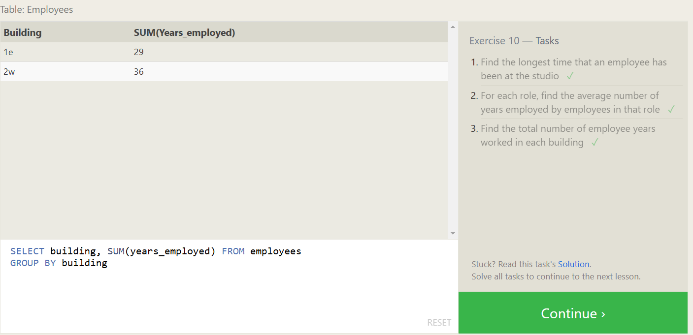

### Exercise 11
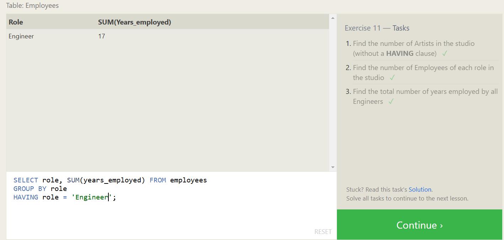

### Exercise 12
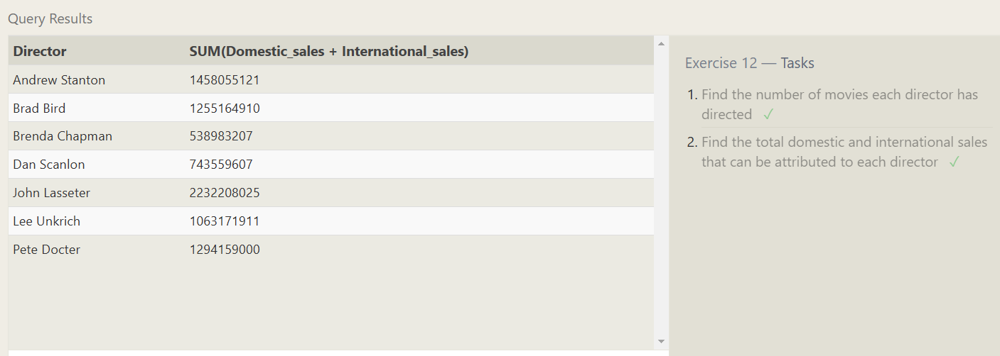

### Exercise 13
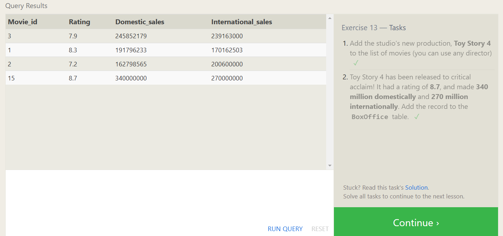

### Exercise 14
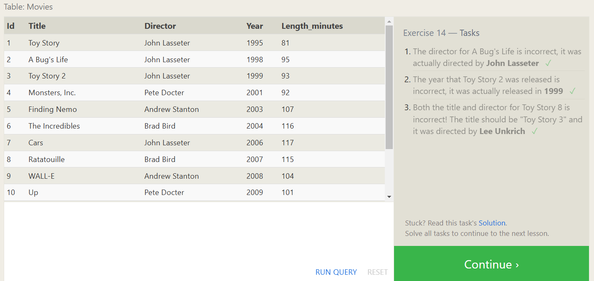

### Exercise 15
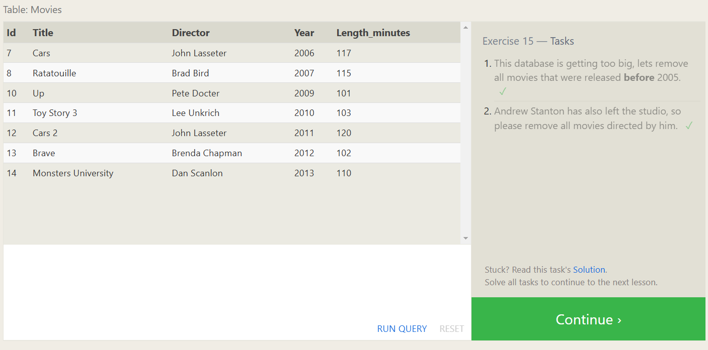

### Exercise 16
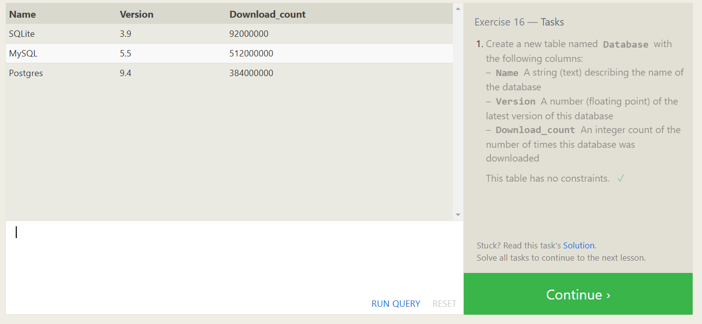

### Exercise 17
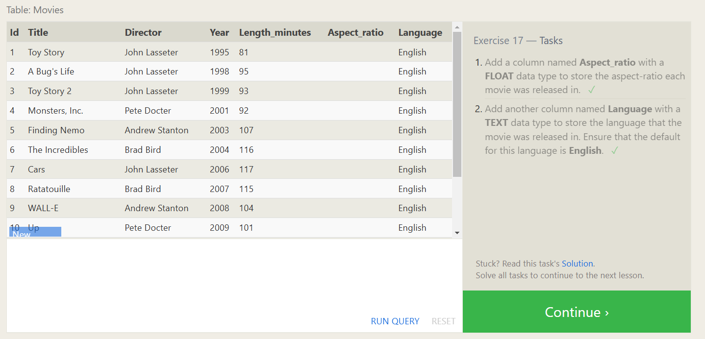

### Exercise 18
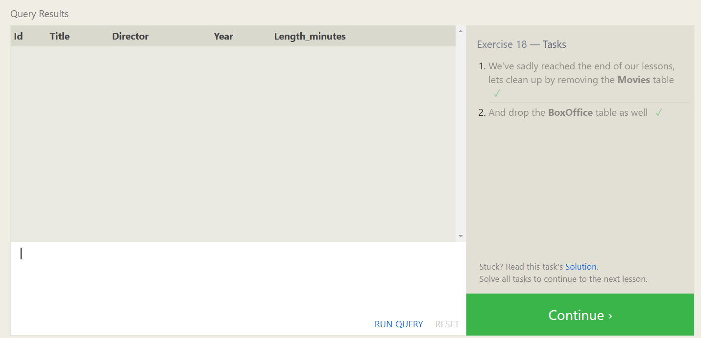

---

## Completion Confirmation

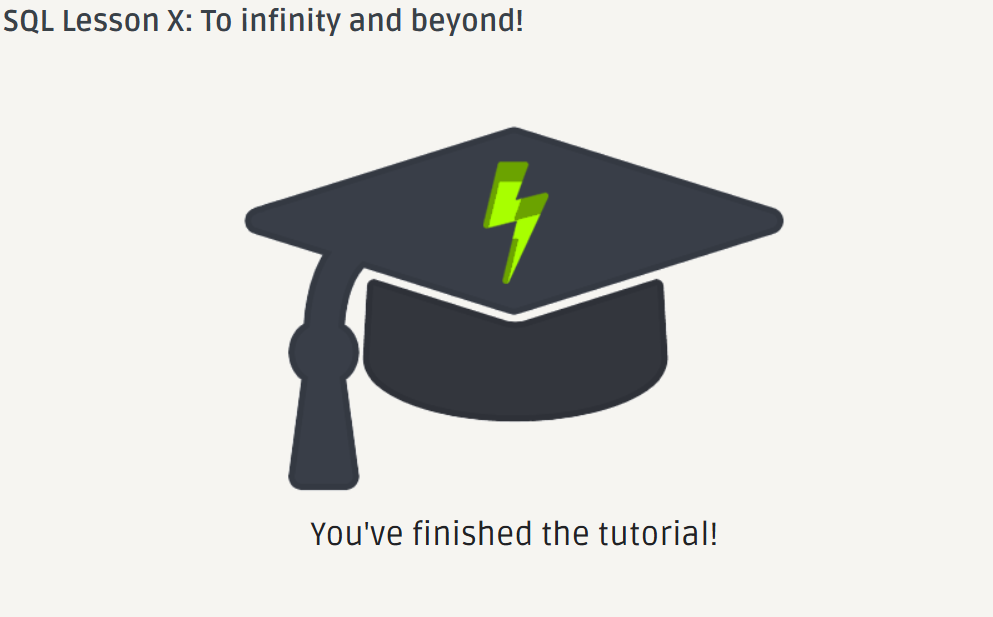
