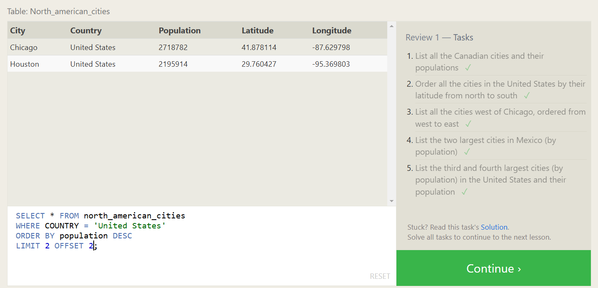

# SQLBolt Solutions

This section contains solutions to interactive SQL lessons from [SQLBolt](https://sqlbolt.com/). Each query is based on exercises covering filtering, sorting, joins, aggregations, and subqueries.

Solutions are written using clean and readable SQL syntax.

---

## Screenshots of Completed Lessons

### Exercise 1

### Exercise 2

### Exercise 3

### Exercise 4

### Exercise 5

### Exercise 6

### Exercise 7

### Exercise 8

### Exercise 9

### Exercise 10

### Exercise 11

### Exercise 12

### Exercise 13

### Exercise 14

### Exercise 15

### Exercise 16

### Exercise 17

### Exercise 18

---

## Completion Confirmation

